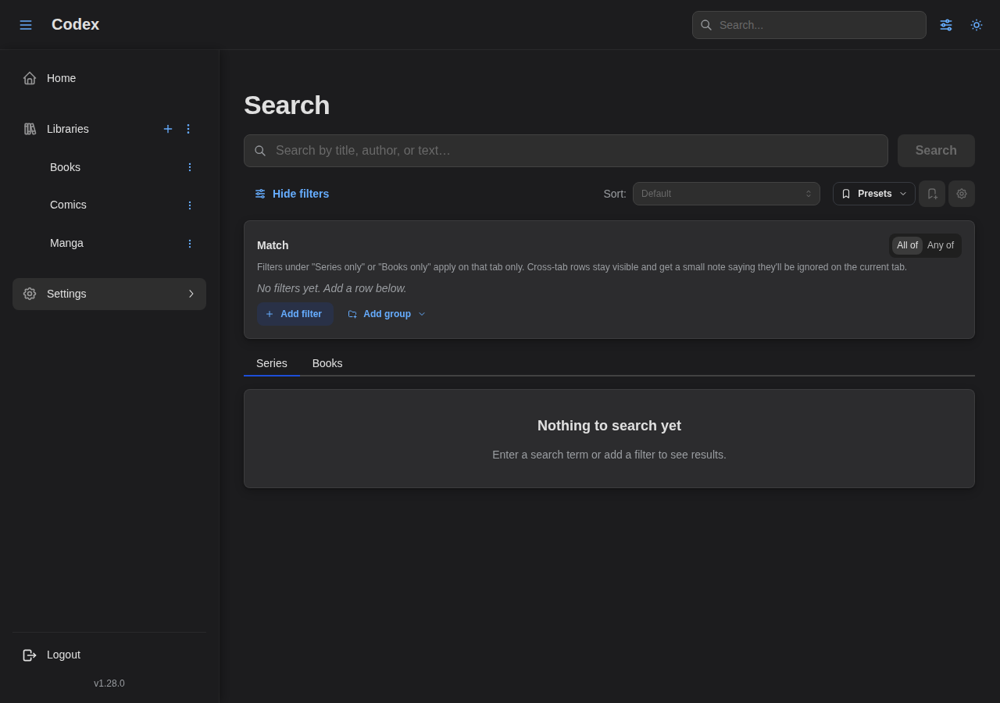
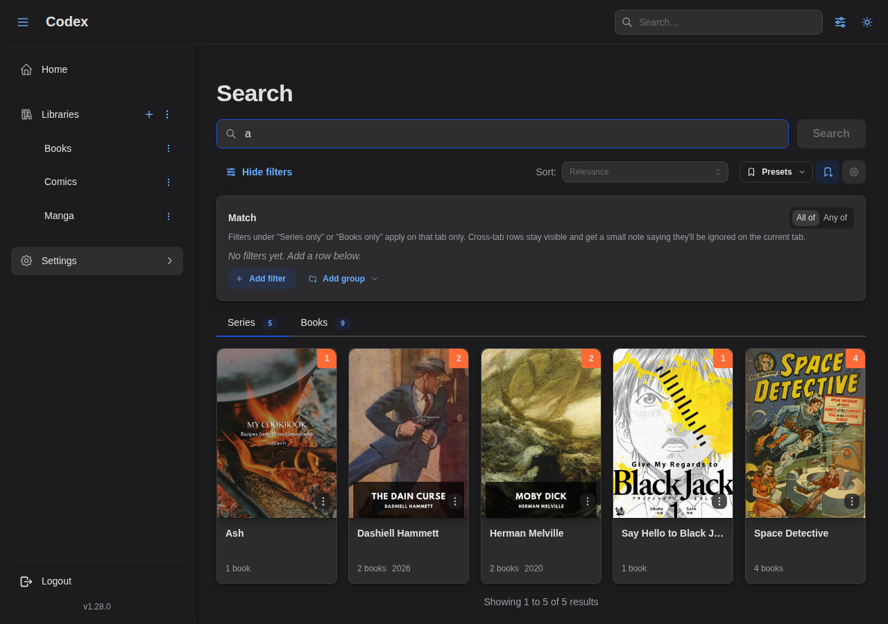
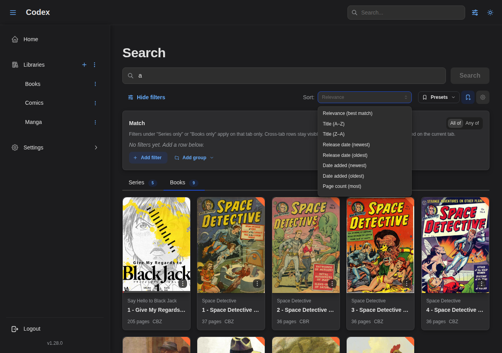
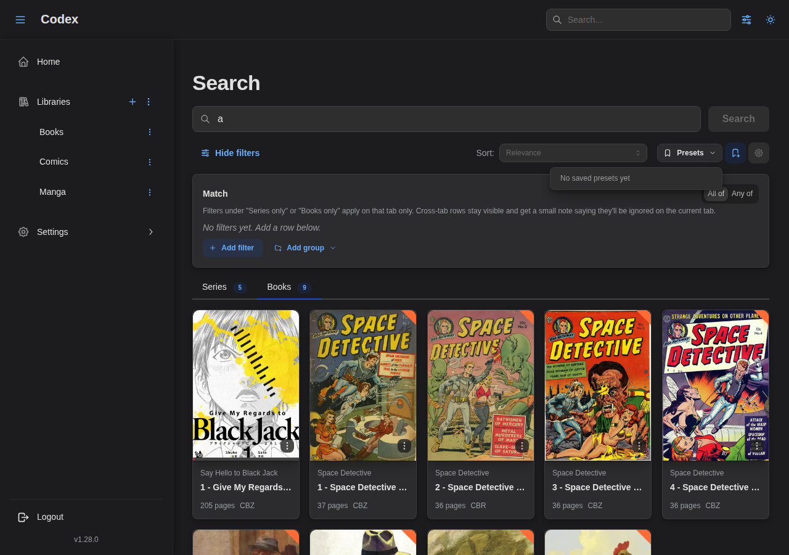

---
---

# Filtering & Search

Codex provides powerful filtering and search capabilities to help you find content in your library. This guide covers the filter UI, condition-based filtering, and full-text search.

## Quick Filters

The library view includes a filter panel with common filters:

### Accessing Filters

1. Navigate to a library
2. Click the **Filter** button in the toolbar
3. The filter panel opens as a drawer

### Filter Groups

#### Read Status

Filter by reading progress:

| Status | Description |
|--------|-------------|
| **Unread** | No reading progress on any book |
| **In Progress** | Currently reading (some progress, not completed) |
| **Read** | All books completed |

#### Publication Status

Filter by series publication status:

| Status | Description |
|--------|-------------|
| **Ongoing** | Series is still being published |
| **Ended** | Series is complete |
| **Hiatus** | Series is on hold |

#### Book Type (Books)

Filter books by their type classification:

| Type | Description |
|------|-------------|
| **Comic** | Western comic books |
| **Manga** | Japanese manga |
| **Novel** | Full-length novels |
| **Novella** | Short novels |
| **Anthology** | Story collections |
| **Artbook** | Art collections |
| **Oneshot** | Single standalone issues |
| **Omnibus** | Combined volumes |
| **Graphic Novel** | Graphic novels |
| **Magazine** | Magazines and periodicals |

#### Genres & Tags

Filter by genres and tags extracted from your media metadata (ComicInfo.xml, EPUB metadata).

### Filter Modes

Each filter group supports two modes:

- **All selected (AND)**: Series must match ALL selected values
- **Any selected (OR)**: Series must match ANY of the selected values

### Include vs Exclude

Click a filter chip to cycle through states:

| State | Visual | Behavior |
|-------|--------|----------|
| **Neutral** | Gray outline | Not applied |
| **Include** | Blue filled | Must match |
| **Exclude** | Red filled with X | Must NOT match |

### Active Filters

Active filters appear as chips below the toolbar. Click the X on any chip to remove it, or click "Clear all" to reset.

## URL Persistence

Filters are saved in the URL for easy sharing and bookmarking:

```
/library/abc123?gf=all:Action,Comedy:-Horror&sf=ongoing
```

Parameters:
- `gf`: Genre filter (`mode:include1,include2:-exclude1`)
- `tf`: Tag filter
- `sf`: Status filter
- `rf`: Read status filter
- `bbt`: Book type filter (books only)

## Advanced Search Page

For questions that combine a text query with structured filters and a sort
order, open **`/search`** (also reachable via the "Advanced search →" link in
the global search bar dropdown).



The page offers:

- A **text query box** with debounced search.
- A **filter builder** that exposes the full condition grammar — including
  nested `allOf` / `anyOf` groups and operators not available on the chip-based
  list-page panels.
- A **sort selector**. When a text query is present, a "Relevance (best match)"
  option appears at the top; clearing the selector returns to the default sort.
- **Series / Books tabs** with live counts. Both tabs fetch in parallel so the
  counts update as soon as you change the filter.
- A **Presets sidebar** for saving and reloading the current `(filter,
  query, sort)` combination — see [Filter Presets](#filter-presets) below.

Results render in the active tab as soon as the query or filter changes:



Switch to the Books tab to see book-level matches for the same query and
filter:


When a text query is set, the **Sort** selector exposes a "Relevance
(best match)" option backed by the fuzzy index, alongside the default
sort fields:



If fuzzy search is enabled on the server, a "Fuzzy enabled" badge appears next
to the page title. See [Full-Text Search](#full-text-search) for the
search-side behaviour.

### Shareable URLs

The page encodes its full state in the URL so you can bookmark or share a
specific search. The `q`, `sort`, `tab`, and `page` parameters are
human-readable; the filter expression rides in a base64url-encoded `c`
parameter to keep nested conditions compact.

When a filter is too complex to fit in the URL, the page drops the `c`
parameter and shows a yellow notice suggesting you save it as a preset. The
preset will reload exactly as built, no length limit.

## Filter Presets

A **preset** is a saved filter combination you can reload later. Presets are
per-user — only you can see, edit, or delete your own.

### Where to save and load presets

Codex has two preset entry points:

- **List-page filter drawer.** Open the filter drawer on the series or books
  list page and use the **Presets** controls at the top. Saves use the chip-
  based grammar of the drawer.
- **Advanced search sidebar** on `/search`. Saves include the text query, the
  full filter expression, and the sort — everything needed to reproduce the
  search.

Both entry points share the same storage and the same **Manage presets**
modal, which lists all of your presets grouped by where they're used
("List pages" / "Advanced search") with inline rename and delete.

### Saving a preset

1. Build a filter (and, on `/search`, optionally add a query and sort).
2. Click the **Save preset** icon.
3. Name the preset.
4. On a list page that's scoped to a single library, choose **This library**
   or **All libraries**:
    - *This library* — the preset appears only on this library's filter panel.
    - *All libraries* — the preset appears on every library's filter panel,
      including the "All libraries" cross-library view.
5. Save.

When you save from the "All libraries" view, the preset is always global.

### Applying a preset

Open the filter drawer (or the `/search` sidebar) and pick a preset from the
"Apply preset…" menu. The page state updates immediately and pagination
returns to page 1.



Presets saved from the advanced search page may use filters that the chip-
based list-page drawer can't represent — for example, year ranges, nested
groups, or path/format filters. When you try to apply one of those on a list
page, Codex surfaces a notification suggesting you open the preset on
`/search` instead.

### Renaming and deleting

The **Manage presets** modal (cog icon next to "Save preset") shows all of
your presets and offers inline rename + delete. Deleting prompts for
confirmation; renames take effect immediately.

## Advanced Filtering (API)

For complex queries, use the `POST /series/list` or `POST /books/list` endpoints.

### Condition Structure

Filters use a tree structure with combinators:

```json
{
  "condition": {
    "allOf": [
      { "genre": { "operator": "is", "value": "Action" } },
      { "genre": { "operator": "isNot", "value": "Horror" } }
    ]
  }
}
```

### Combinators

| Combinator | SQL Equivalent | Description |
|------------|---------------|-------------|
| `allOf` | AND | All conditions must match |
| `anyOf` | OR | Any condition can match |

### Field Operators

Used by string-valued fields (`genre`, `tag`, `name`, `path`, `format`, …).

| Operator | Description | Example |
|----------|-------------|---------|
| `is` | Equals | `{"operator": "is", "value": "Action"}` |
| `isNot` | Not equals | `{"operator": "isNot", "value": "Horror"}` |
| `isNull` | Field is null | `{"operator": "isNull"}` |
| `isNotNull` | Field has value | `{"operator": "isNotNull"}` |
| `contains` | Contains substring | `{"operator": "contains", "value": "bat"}` |
| `doesNotContain` | Does not contain substring | `{"operator": "doesNotContain", "value": "draft"}` |
| `beginsWith` | Starts with | `{"operator": "beginsWith", "value": "The"}` |
| `endsWith` | Ends with | `{"operator": "endsWith", "value": "Volume 1"}` |

### Number Operators

Used by numeric fields (`year`, `pageCount`).

| Operator | Description | Example |
|----------|-------------|---------|
| `eq` | Equals | `{"operator": "eq", "value": 2024}` |
| `ne` | Not equals | `{"operator": "ne", "value": 0}` |
| `gt` | Greater than | `{"operator": "gt", "value": 100}` |
| `gte` | Greater than or equal | `{"operator": "gte", "value": 100}` |
| `lt` | Less than | `{"operator": "lt", "value": 500}` |
| `lte` | Less than or equal | `{"operator": "lte", "value": 500}` |
| `between` | Within a range (open-ended supported) | `{"operator": "between", "min": 2000, "max": 2010}` |
| `isNull` | No value set | `{"operator": "isNull"}` |
| `isNotNull` | Has a value | `{"operator": "isNotNull"}` |

`between` accepts either bound as `null` to express open-ended ranges, e.g.
`{"min": 2000, "max": null}` means "year >= 2000".

### Date Operators

Used by timestamp fields (`dateAdded`). Values are ISO-8601 UTC strings.

| Operator | Description | Example |
|----------|-------------|---------|
| `after` | Strictly after | `{"operator": "after", "value": "2024-01-01T00:00:00Z"}` |
| `before` | Strictly before | `{"operator": "before", "value": "2024-12-31T23:59:59Z"}` |
| `onOrAfter` | At or after | `{"operator": "onOrAfter", "value": "2024-01-01T00:00:00Z"}` |
| `onOrBefore` | At or before | `{"operator": "onOrBefore", "value": "2024-12-31T23:59:59Z"}` |
| `between` | Within a range (open-ended supported) | `{"operator": "between", "start": "2024-01-01T00:00:00Z", "end": "2024-06-30T23:59:59Z"}` |
| `isNull` | No value set | `{"operator": "isNull"}` |
| `isNotNull` | Has a value | `{"operator": "isNotNull"}` |

### Series Filter Fields

| Field | Description | Operators |
|-------|-------------|-----------|
| `libraryId` | Library UUID | `is`, `isNot` |
| `genre` | Genre name | `is`, `isNot` |
| `tag` | Tag name | `is`, `isNot` |
| `sharingTag` | Sharing tag name (admin) | `is`, `isNot` |
| `status` | Publication status | `is`, `isNot` |
| `publisher` | Publisher name | `is`, `isNot`, `isNull`, `isNotNull` |
| `language` | Language code (BCP47) | `is`, `isNot`, `isNull`, `isNotNull` |
| `name` | Series name | `is`, `isNot`, `contains`, `beginsWith` |
| `titleSort` | Sort title | `is`, `isNot`, `contains`, `beginsWith` |
| `readStatus` | Reading status (`unread` / `in_progress` / `read`) | `is`, `isNot` |
| `completion` | Series is complete | `isTrue`, `isFalse` |
| `hasExternalSourceId` | Linked to an external source | `isTrue`, `isFalse` |
| `hasUserRating` | User has rated this series | `isTrue`, `isFalse` |
| `isTracked` | Release tracking enabled | `isTrue`, `isFalse` |
| `year` | Publication year | All [number operators](#number-operators) |
| `author` | Author name (matches any role) | `is`, `isNot`, `contains`, `beginsWith` |
| `dateAdded` | When the series first appeared in the library | All [date operators](#date-operators) |

### Book Filter Fields

| Field | Description | Operators |
|-------|-------------|-----------|
| `libraryId` | Library UUID | `is`, `isNot` |
| `seriesId` | Series UUID | `is`, `isNot` |
| `genre` | Genre name (inherited from series) | `is`, `isNot` |
| `tag` | Tag name (inherited from series) | `is`, `isNot` |
| `title` | Book title | `is`, `isNot`, `contains` |
| `readStatus` | Reading status | `is`, `isNot` |
| `hasError` | Has parsing error | `isTrue`, `isFalse` |
| `bookType` | Book type classification | `is`, `isNot`, `isNull`, `isNotNull` |
| `path` | File path (substring match) | `is`, `isNot`, `contains`, `beginsWith`, `endsWith` |
| `format` | File format (`cbz`, `cbr`, `epub`, `pdf`, …) | `is`, `isNot` |
| `pageCount` | Number of pages | All [number operators](#number-operators) |
| `dateAdded` | When the book first appeared in the library | All [date operators](#date-operators) |

## Example Queries

### Simple Genre Filter

```json
{
  "condition": {
    "genre": { "operator": "is", "value": "Action" }
  }
}
```

### Multiple Genres (OR)

Match series with Action OR Comedy:

```json
{
  "condition": {
    "anyOf": [
      { "genre": { "operator": "is", "value": "Action" } },
      { "genre": { "operator": "is", "value": "Comedy" } }
    ]
  }
}
```

### Genre with Exclusion

Match Action series but exclude Horror:

```json
{
  "condition": {
    "allOf": [
      { "genre": { "operator": "is", "value": "Action" } },
      { "genre": { "operator": "isNot", "value": "Horror" } }
    ]
  }
}
```

### Complex Nested Query

(Action AND Comedy) OR (Fantasy AND NOT Horror):

```json
{
  "condition": {
    "anyOf": [
      {
        "allOf": [
          { "genre": { "operator": "is", "value": "Action" } },
          { "genre": { "operator": "is", "value": "Comedy" } }
        ]
      },
      {
        "allOf": [
          { "genre": { "operator": "is", "value": "Fantasy" } },
          { "genre": { "operator": "isNot", "value": "Horror" } }
        ]
      }
    ]
  }
}
```

### Read Status Filter

Find series currently being read:

```json
{
  "condition": {
    "readStatus": { "operator": "is", "value": "in_progress" }
  }
}
```

### Multi-Field Filter

Ongoing Action series with Favorite tag:

```json
{
  "condition": {
    "allOf": [
      { "status": { "operator": "is", "value": "ongoing" } },
      { "genre": { "operator": "is", "value": "Action" } },
      { "tag": { "operator": "is", "value": "Favorite" } }
    ]
  }
}
```

### Book Type Filter

Find all manga books:

```json
{
  "condition": {
    "bookType": { "operator": "is", "value": "manga" }
  }
}
```

Find books without a type classification:

```json
{
  "condition": {
    "bookType": { "operator": "isNull" }
  }
}
```

### Format Filter

CBZ files only:

```json
{
  "condition": {
    "format": { "operator": "is", "value": "cbz" }
  }
}
```

### Year Range

Series published between 2000 and 2009 (inclusive):

```json
{
  "condition": {
    "year": { "operator": "between", "min": 2000, "max": 2009 }
  }
}
```

Open-ended: everything from 2020 onward:

```json
{
  "condition": {
    "year": { "operator": "gte", "value": 2020 }
  }
}
```

### Recently Added

Books added in the last 30 days (the client supplies the cutoff ISO
timestamp):

```json
{
  "condition": {
    "dateAdded": { "operator": "onOrAfter", "value": "2026-04-19T00:00:00Z" }
  }
}
```

## Full-Text Search

Combine full-text search with condition filters:

```json
{
  "fullTextSearch": "batman",
  "condition": {
    "genre": { "operator": "is", "value": "Action" }
  }
}
```

The text query is combined with the structured condition using AND logic and
respects the user's sharing-tag permissions.

### Fuzzy Matching

When the **`search.fuzzy.enabled`** server setting is on, text queries route
through an in-memory fuzzy index that tolerates typos and partial matches and
ranks results by relevance. The index is updated incrementally as items are
added, edited, or removed.

When fuzzy is off, the same query falls back to a case-insensitive `LIKE`
match against titles. No behavioural difference besides ranking quality.

### Relevance Sort

When a text query is set, the `/search` page defaults to ranking results by
fuzzy score. You can override this from the sort dropdown to use any of the
standard sort fields (release date, title, page count, etc.) — the relevance
ranking is dropped when you do so.

The API mirrors this:

- `sort` unset + `fullTextSearch` set → implicit relevance ranking.
- `sort=relevance` → explicit relevance (also accepts `score` and
  `relevance,asc`/`desc`); falls back to the natural default if no query is
  present.
- Any other explicit `sort` value → that sort wins.

### Global Search

The header search bar searches both series and books:

1. Type at least 2 characters.
2. Results appear in a dropdown grouped by type.
3. Click a result to navigate, press Enter for the simple results page, or
   click **Advanced search →** to open `/search` pre-filled with your query.

## Performance Tips

1. **Use specific filters**: More specific filters run faster
2. **Combine with library_id**: Always include library_id when filtering within a library
3. **Avoid deep nesting**: Very deeply nested conditions may be slower
4. **Use pagination**: Always paginate results for large libraries

## Next Steps

- [API Documentation](./api) - Full API reference
- [Libraries](./libraries) - Library management
- [OPDS](./opds) - OPDS catalog access
