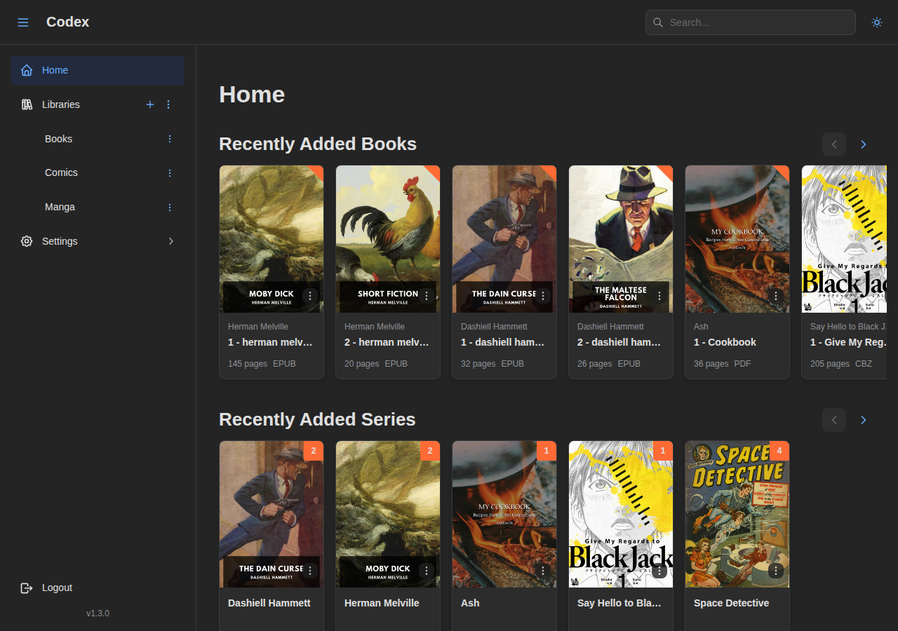

---
---

import DockerRunQuickStart from "./_partials/_docker-run-quick-start.mdx";
import DockerVolumes from "./_partials/_docker-volumes.mdx";
import BinaryQuickStart from "./_partials/_binary-quick-start.mdx";

# Getting Started

This guide walks you through setting up Codex and creating your first library.

## System Requirements

- **CPU**: 1 core (2+ recommended for scanning)
- **RAM**: 512 MB (1 GB+ recommended)
- **Storage**: Depends on your library size and thumbnail cache
- **OS**: Linux, macOS, or Windows

## Quick Start with Docker (Recommended)

The fastest way to get started is with a single `docker run` command:

<DockerRunQuickStart />

Replace `/path/to/your/library` with the path to your comics, manga, or ebooks folder.

### Volume Mounts

<DockerVolumes />

:::tip Docker Compose
For a more maintainable setup, see the [Docker Deployment guide](./deployment/docker) for Docker Compose examples.
:::

## Quick Start with Binary

If you prefer running without Docker:

### 1. Download Codex

Download the latest release from [GitHub Releases](https://github.com/AshDevFr/codex/releases).

Available platforms:

- Linux x86_64 / ARM64
- macOS x86_64 (Intel) / ARM64 (Apple Silicon)
- Windows x86_64

### 2. Install and Run

```bash
# Extract and make executable
tar -xzf codex-x.x.x-linux-x86_64.tar.gz
chmod +x codex

# Optional: move to PATH
sudo mv codex /usr/local/bin/
```

<BinaryQuickStart />

## First Login

1. Open Codex in your browser at `http://localhost:8080`
2. Complete the setup wizard to create your admin account


3. Optionally configure basic settings (application name, user registration)


4. Log in with your new credentials


## Creating Your First Library

1. Click **Libraries** in the sidebar, then click **+** to add a new library
2. Fill in the **General** tab:
   - **Name**: A descriptive name (e.g., "My Comics")
   - **Path**: The folder path containing your files
     - Docker: Use the container path (e.g., `/library`)
     - Binary: Use the local path (e.g., `/home/user/comics`)
   - **Default Reading Direction**: Choose based on your content type


3. Configure the **Strategy** tab for how series and books are detected


4. Set up **Scanning** options:
   - **Manual**: Scan only when you trigger it
   - **Automatic**: Schedule regular scans with cron expressions


5. Click **Create Library**

### Multiple Libraries (Docker)

Mount multiple folders in your Docker command or compose file:

```yaml
volumes:
  - /media/comics:/library/comics:ro
  - /media/manga:/library/manga:ro
  - /media/ebooks:/library/ebooks:ro
```

Then create separate libraries pointing to `/library/comics`, `/library/manga`, etc.

## Running Your First Scan

If you enabled "Scan on startup", Codex will automatically scan when the library is created.

For manual scans:

1. Go to your library in the sidebar
2. Click the **Scan** button
3. Choose **Normal** for incremental scan or **Deep** for full re-scan
4. Watch the progress in real-time

## Browsing Your Library

Once scanning completes:

- **Home**: See "On Deck" (continue reading) and recently added series
- **By Series**: Click a library in the sidebar to browse series
- **By Books**: Toggle between series and books view




### Reading a Book

1. Click on a book cover to open the reader
2. Navigate with arrow keys, swipe, or click left/right edges
3. Progress is saved automatically
4. Access settings via the gear icon in the toolbar


## Upgrading

### Docker

```bash
docker pull ghcr.io/ashdevfr/codex:latest
docker stop codex && docker rm codex
# Run your docker run command again
```

### Binary

1. Download the new release
2. Stop Codex
3. Replace the binary
4. Start Codex (migrations run automatically)

## Troubleshooting

### Library Not Found

**Docker**: Ensure the volume is mounted correctly:

```bash
docker exec codex ls -la /library
```

**Binary**: Verify the path exists and Codex has read permissions.

### Books Not Appearing

1. Verify file format is supported (CBZ, CBR, EPUB, PDF)
2. Check files aren't corrupted
3. Run a deep scan to re-process all files

### Login Issues

1. Verify credentials are correct
2. Check JWT secret is set in configuration
3. Clear browser cookies and try again

For more help, see the [Troubleshooting Guide](./troubleshooting).

## Next Steps

- [Configuration options](./configuration)
- [Docker Compose & PostgreSQL](./deployment/docker)
- [Running as a service](./deployment/systemd)
- [OPDS for e-readers](./opds)
- [API documentation](./api)
