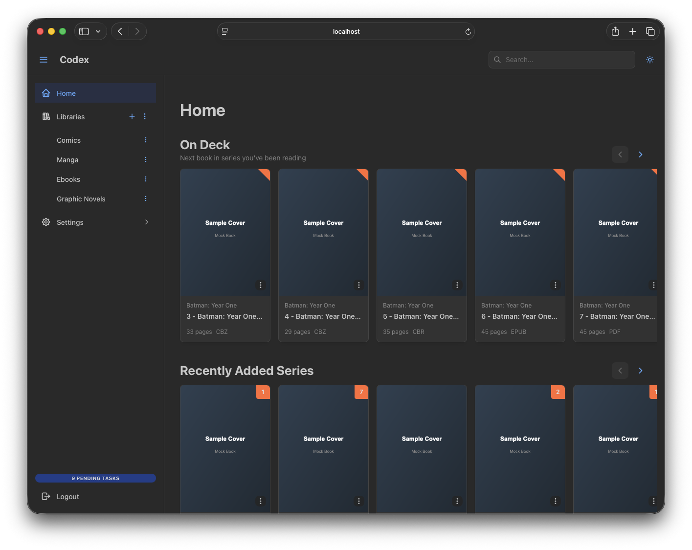

# Introduction

**Codex** is a next-generation digital library server for comics, manga, and ebooks built in Rust. Designed to scale horizontally while remaining simple for homelab deployments, Codex provides a powerful self-hosted solution for managing and reading your digital media collections.



## Key Features

### Multi-Format Support

Codex supports the most popular digital comic and ebook formats:

- **CBZ** (Comic Book ZIP) - Standard comic archive format with fast extraction
- **CBR** (Comic Book RAR) - RAR-based comic archives (optional feature)
- **EPUB** - Standard ebook format (versions 2.0 and 3.0)
- **PDF** - Portable Document Format

### Dual Database Support

Choose the database that fits your deployment:

- **SQLite** - Zero-configuration, perfect for homelab and small deployments
- **PostgreSQL** - Production-ready, supports horizontal scaling and concurrent users

### Horizontal Scaling

Codex features a stateless architecture designed for modern deployments:

- No server-side sessions (JWT-based authentication)
- All state stored in the database
- Perfect for Kubernetes and container orchestration
- Run multiple instances behind a load balancer

### Real-Time Updates

Stay informed with Server-Sent Events (SSE):

- Live scan progress tracking
- Instant notifications for new books and series
- Real-time task progress updates

### Rich Metadata

Automatic metadata extraction from your files:

- **ComicInfo.xml** parsing for comics
- EPUB metadata extraction
- PDF document properties
- Automatic series and volume detection from filenames

### Flexible Organization

Organize your library your way:

- Multiple libraries with independent settings
- Per-library scanning strategies
- Customizable cron schedules for automatic scans
- Series and book organization

### OPDS Catalog

Standard e-reader protocol support:

- Compatible with popular e-reader apps
- Browse and download books directly from your device
- Search functionality

### Comprehensive API

Full-featured REST API for integration:

- OpenAPI documentation with Scalar
- Multiple authentication methods (JWT, API Keys, Basic Auth)
- Fine-grained permission system

## Architecture Overview

```
┌─────────────────────────────────────────────────────────────┐
│                     Web Browser / Apps                       │
│            (React Frontend, OPDS Readers, API Clients)       │
└─────────────────────────────────────────────────────────────┘
                              │
                              ▼
┌─────────────────────────────────────────────────────────────┐
│                      Codex Server                            │
│  ┌─────────────┐  ┌──────────────┐  ┌───────────────────┐  │
│  │  REST API   │  │     OPDS     │  │   SSE Streams     │  │
│  │  /api/v1/*  │  │   /opds/*    │  │ (Real-time events)│  │
│  └─────────────┘  └──────────────┘  └───────────────────┘  │
│  ┌─────────────────────────────────────────────────────┐   │
│  │           Background Task Processing                  │   │
│  │  (Scanning, Thumbnails, Analysis, Duplicate Detection)│   │
│  └─────────────────────────────────────────────────────┘   │
└─────────────────────────────────────────────────────────────┘
                              │
            ┌─────────────────┴─────────────────┐
            ▼                                   ▼
┌───────────────────────────┐     ┌───────────────────────────┐
│     SQLite/PostgreSQL     │     │       File System          │
│        Database           │     │   (Media + Thumbnails)     │
└───────────────────────────┘     └───────────────────────────┘
```

## Use Cases

### Home Library Server

Run Codex on a Raspberry Pi or NAS to serve your personal comic and ebook collection. SQLite keeps things simple with zero external dependencies.

### Multi-User Environment

Deploy with PostgreSQL to support multiple concurrent users with proper read tracking and permissions.

### Kubernetes Deployment

Scale horizontally with multiple replicas behind a load balancer. Codex's stateless design makes it perfect for cloud-native deployments.

### Integration Platform

Use the comprehensive API to build custom tools, sync with other services, or integrate with automation workflows.

## CBR Support and Licensing

CBR (Comic Book RAR) archive support requires the UnRAR library, which uses a **proprietary license** (not standard open source). The UnRAR license allows free use for extraction but prohibits creating RAR compression software.

- **Pre-built binaries**: Include CBR support by default
- **Docker images**: Include CBR support by default
- **Building from source**:
  - With CBR: `cargo build --release` (default)
  - Without CBR: `cargo build --release --no-default-features`

## Project Status

Codex is actively developed and used in production environments. While the core features are stable, new features and improvements are being added regularly.

## Getting Help

- **Documentation**: You're reading it!
- **GitHub Issues**: [Report bugs or request features](https://github.com/AshDevFr/codex/issues)

## License

Codex is released under the MIT License.

## Next Steps

Ready to get started? Head to the [Getting Started guide](./getting-started) to have Codex running in minutes.

For more details, see:
- [Configuration](./configuration) - All configuration options
- [Deployment](./deployment) - Docker Compose, systemd, Kubernetes
- [API Reference](/docs/api/codex-api) - REST API documentation
