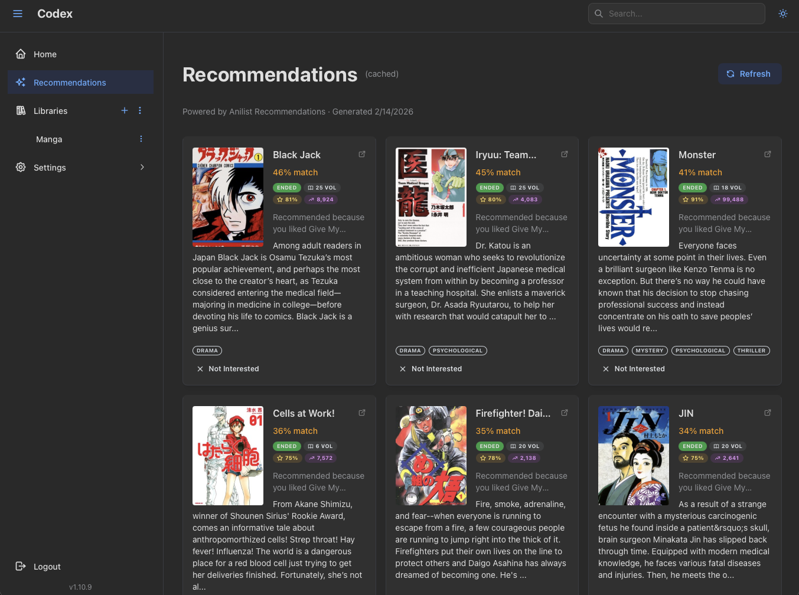
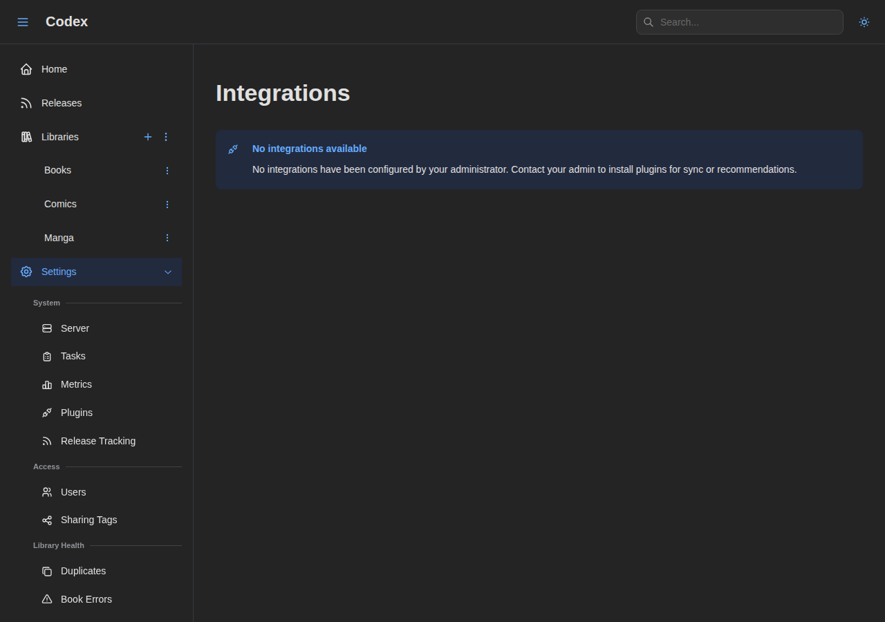
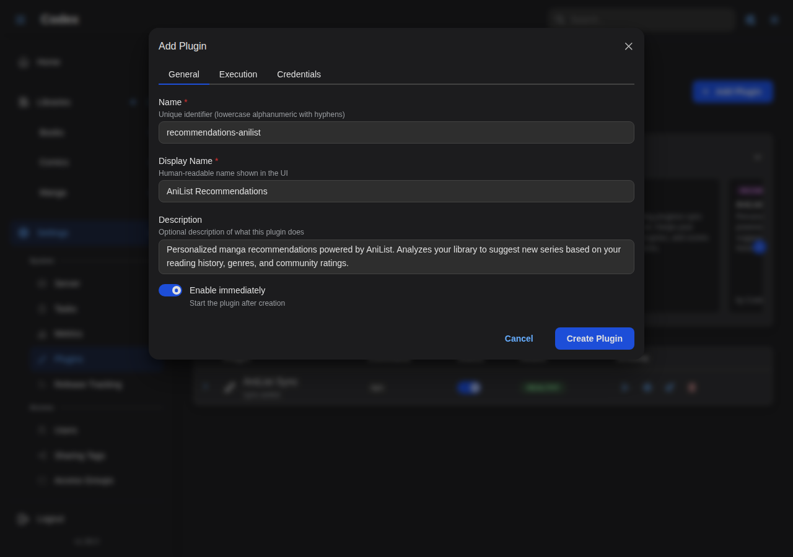
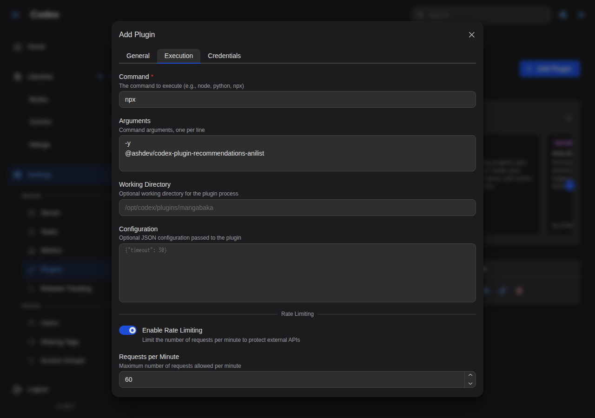

---
---

# AniList Recommendations Plugin

The AniList Recommendations plugin generates personalized manga recommendations from [AniList](https://anilist.co) community data, seeded by your highest-rated library entries. Recommendations show up on the **Recommendations** page in Codex with cover art, summary, scores, and a "based on X" attribution.

This is a **user plugin**: each user connects their own AniList account and gets recommendations tailored to their library and ratings. Recommendations are generated and cached server-side, so users see them immediately on next page load after a refresh.

## Features

- Personalized manga recommendations based on your library ratings.
- Seeded by entries you've rated highly (or read recently when ratings aren't set).
- Per-user filters: country of origin, excluded genres, excluded formats, minimum AniList score.
- Title-search fallback for series without an AniList external ID.
- Server-side caching with explicit "Refresh" and "Dismiss" controls.

## Authentication

The plugin supports two authentication paths.

### OAuth (recommended)

If your administrator has configured OAuth:

1. Go to **Settings → Integrations**.
2. Click **Connect with AniList Recommendations**.
3. Authorize Codex on AniList.
4. You're connected.

### Personal access token

If OAuth is not configured:

1. Go to [AniList Developer Settings](https://anilist.co/settings/developer).
2. Click **Create New Client** and set the redirect URL to `https://anilist.co/api/v2/oauth/pin`.
3. Save, then **Authorize** your client.
4. Copy the token shown on the pin page.
5. In Codex, go to **Settings → Integrations** and paste the token in the **Access Token** field for AniList Recommendations.

## Admin setup

### Adding the plugin

The plugin ships in the official plugin store. From **Settings → Plugins**, find **AniList Recommendations** in the carousel and click **Add**. The pre-filled form has the recommended command and execution settings.

To add it manually:

1. Log in as an administrator and navigate to **Settings → Plugins**.
2. Click **Add Plugin** and fill in the form:
   - **Name**: `recommendations-anilist`
   - **Display Name**: `AniList Recommendations`
   - **Command**: `npx`
   - **Arguments**: `-y @ashdev/codex-plugin-recommendations-anilist@1.9.3`
3. Save and click **Test Connection**.

### Configuring OAuth (optional)

To let users connect via OAuth instead of pasting a token:

1. Go to [AniList Developer Settings](https://anilist.co/settings/developer).
2. Click **Create New Client**.
3. Set the redirect URL to `{your-codex-url}/api/v1/user/plugins/oauth/callback`.
4. Save and copy the **Client ID**.
5. In Codex, open **Settings → Plugins**, click the gear icon on AniList Recommendations, switch to the **OAuth** tab, paste the Client ID (and optionally the Client Secret), and save.

Without OAuth configured the plugin still works; users just paste an access token instead.

### npx options

| Configuration | Arguments | When to use |
| --- | --- | --- |
| Latest version | `-y @ashdev/codex-plugin-recommendations-anilist` | Auto-update on every spawn |
| Pinned version | `-y @ashdev/codex-plugin-recommendations-anilist@1.9.3` | Recommended for production |
| Fast startup | `-y --prefer-offline @ashdev/codex-plugin-recommendations-anilist@1.9.3` | Skips the npm version check when the package is cached |

## How it works

### Generation flow

When the user clicks **Refresh** on the Recommendations page (or the periodic refresh task fires), Codex calls `recommendations/generate` on the plugin with a user-library snapshot:

1. The plugin walks the library entries and resolves each to an AniList media ID:
   - First by checking for an `api:anilist` external ID on the series.
   - Then, if `searchFallback` is enabled, by querying AniList's search API by title.
2. It picks the highest-rated entries as **seeds** and fetches AniList's community recommendations for each one.
3. Results are scored locally (a blend of community rating and AniList average score), filtered against the user's config, and de-duplicated against:
   - Series already in the user's library.
   - Recommendations the user has dismissed (persisted across runs).
4. The top recommendations are returned to Codex and cached.

### External ID matching

The plugin uses `api:anilist` external IDs as the canonical match. Once a series has been matched (via this plugin, the [AniList Sync](./anilist-sync.md) plugin, or [MangaBaka Metadata](./mangabaka.md) populating the cross-reference), every subsequent run uses the stored ID and skips the title-search fallback.

For libraries that haven't been pre-matched, leave `searchFallback` on so the plugin can still seed recommendations. Once a library is mostly matched, you can flip it off for stricter behavior.

### Dismissed recommendations

When you dismiss a recommendation from the UI, the plugin persists the AniList ID in its plugin storage. Future generations skip that ID, so dismissals stick across refreshes. The dismiss state can be cleared via the plugin's clear action (or by disconnecting and reconnecting the plugin, which wipes all plugin storage).

## Configuration

### Per-user settings

Configure these in **Settings → Integrations → AniList Recommendations → Settings**.

| Option | Default | Description |
| --- | --- | --- |
| **Search Fallback** | On | When a library series has no AniList ID, search by title to find a match. Disable for strict-ID-only matching. |
| **Country of Origin Filter** | empty | Comma-separated ISO country codes to include (e.g. `JP` for manga, `KR` for manhwa, `CN` for manhua). Empty means no filter. |
| **Excluded Genres** | empty | Comma-separated genres to exclude (e.g. `Hentai,Ecchi`). |
| **Excluded Formats** | empty | Comma-separated formats to exclude. Valid values: `MANGA`, `NOVEL`, `ONE_SHOT`. |
| **Minimum AniList Score** | `0` | Minimum AniList community average score (0-100) to surface a recommendation. Set to 0 to disable. |

These settings are scoped per user; each connected user gets their own filter set.

### Codex sync settings (shared)

The same `_codex` settings used by sync plugins also influence which library entries the recommendation plugin sees:

| Key | Default | Effect on recommendations |
| --- | --- | --- |
| `includeCompleted` | On | Whether completed series count as seed candidates |
| `includeInProgress` | On | Whether in-progress series count as seed candidates |
| `syncRatings` | On | Whether scores get sent to the plugin (used to weight seed selection) |

See the [Plugins overview](./index.md#codex-sync-settings) for the full reference.

### Metadata enrichment

The admin-managed [Metadata Enrichment](./anilist-sync.md#metadata-enrichment) policy also governs recommendation plugins: genres and tags are attached to the library seeds sent to the service by default, and an admin can turn them off per plugin (in the plugin's **Configure** dialog) to trim the payload. The toggles only take effect for plugins whose manifest declares the enrichment capability.

## Using the plugin

Once connected:

1. Open the **Recommendations** page from the sidebar.
2. The first visit triggers a generation if none is cached. Subsequent visits show the cached set immediately.
3. Each card shows cover, title, summary, AniList score, and a **based on X** attribution naming the seed series.
4. Actions on each card:
   - **Open in AniList**: jumps to the AniList page in a new tab.
   - **Dismiss**: hides the recommendation from this and future generations.
5. The page header has a **Refresh** action that re-runs generation on demand.

A series that's already in your library is flagged with an `In library` badge but kept in the result so you can see why it surfaced (the seed match is still meaningful).

## Privacy

The plugin sends:

- The titles of your seed series (for fallback search) to AniList.
- The AniList IDs of your seed series (for community-recommendation lookup) to AniList.
- Your access token, on every request.

It does **not** send file contents, paths, or images. Codex stores nothing about your AniList account beyond the OAuth token / pasted access token (encrypted at rest with AES-256-GCM) and the dismissed-IDs list.

## Troubleshooting

### "Not connected"

The OAuth token has expired or never landed. Click **Connect with AniList Recommendations** again in **Settings → Integrations**.

### "No recommendations" after a refresh

Possible causes:

- **No seeds**: you have no series rated highly enough (or none at all). Rate a few series first, or relax the seed criteria via the `_codex` sync settings.
- **All seeds unmatched**: the plugin couldn't resolve any library entries to AniList IDs. Match a few manually via the [AniList Sync](./anilist-sync.md) plugin, or run [MangaBaka Metadata](./mangabaka.md) to pre-populate AniList IDs across the library.
- **Filters too tight**: a strict country filter combined with an aggressive minimum score can leave nothing in the result. Loosen one filter at a time.

### Rate limited

AniList has a community rate limit (~90 requests/minute). The plugin auto-retries once on a 429 with the suggested delay. If you keep hitting limits, lower the seed count by reducing the number of highly-rated series in your library, or stretch the cadence between refreshes.

### Recommendations include things I've already read

The de-dup uses AniList IDs from your library entries. If a series was matched manually but the external ID never got written back, the plugin will re-recommend it. Run [MangaBaka Metadata](./mangabaka.md) or use the per-series **Edit External IDs** modal to attach an `api:anilist` ID, then refresh.

## Next steps

- [AniList Sync](./anilist-sync.md): sync reading progress for the same library.
- [MangaBaka Metadata](./mangabaka.md): populate AniList external IDs across your library so this plugin doesn't fall back to title search.
- [Plugins overview](./index.md): the security and privacy model for user plugins.
