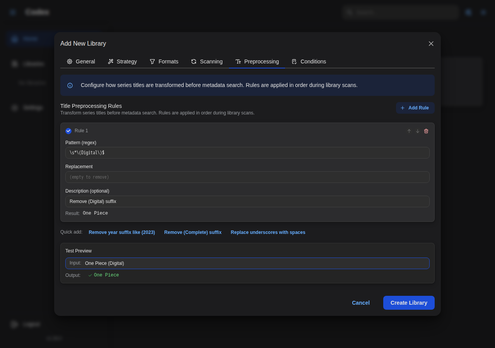
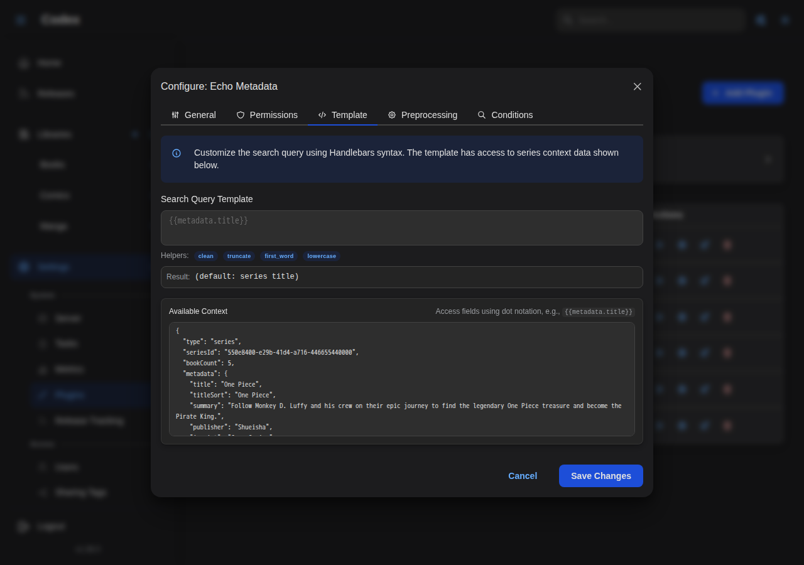
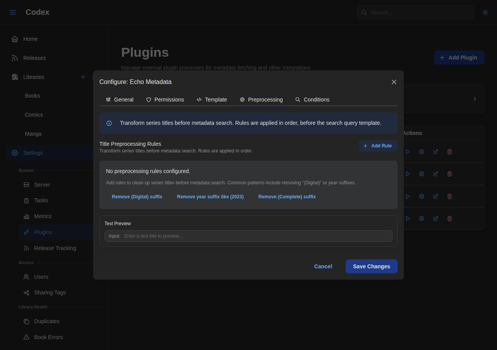
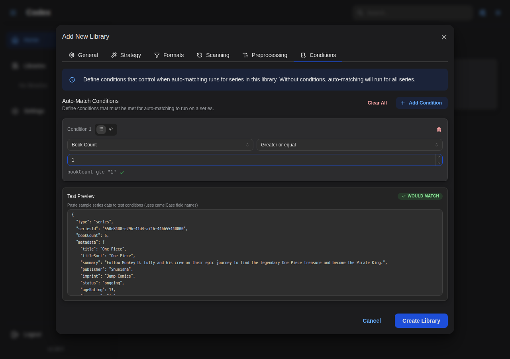
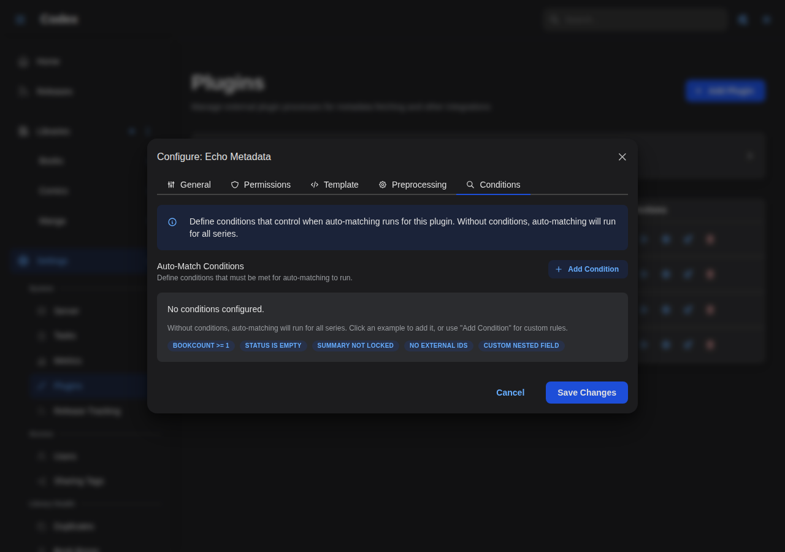

---
---

# Preprocessing Rules & Auto-Match Conditions

Codex provides powerful tools to customize how metadata is searched and when auto-matching occurs. This guide covers title preprocessing rules, search query templates, auto-match conditions, and external ID tracking.

## Overview

When Codex auto-matches series with metadata plugins, it follows this flow:

```
                        SCAN TIME
┌────────────────────────────────────────────────────────────────┐
│  Directory Name: "One Piece (Digital)"                         │
│       ↓                                                        │
│  series.name = "One Piece (Digital)" (preserved for files)     │
│       ↓                                                        │
│  Library title_preprocessing_rules applied                     │
│       ↓                                                        │
│  series_metadata.title = "One Piece" (cleaned for display)     │
└────────────────────────────────────────────────────────────────┘
                           ↓
                    AUTO-MATCH TIME
┌────────────────────────────────────────────────────────────────┐
│  1. Check library auto_match_conditions → skip if fails        │
│  2. Check plugin auto_match_conditions → skip if fails         │
│  3. If use_existing_external_id && external ID exists:         │
│     → Call plugin.get(external_id) directly                    │
│  4. Apply plugin search_query_template (Handlebars)            │
│  5. Apply plugin search_preprocessing_rules                    │
│  6. Call plugin.search(query)                                  │
│  7. Save external ID for future use                            │
└────────────────────────────────────────────────────────────────┘
```

## Title Preprocessing Rules

Preprocessing rules use regex patterns to clean up series titles. They're applied during library scanning to transform directory names into clean display titles.

### Configuration Location

- **Library Settings** → Preprocessing tab
- Applied when new series are created during scan



### Rule Structure

```json
[
  {
    "pattern": "\\s*\\(Digital\\)$",
    "replacement": "",
    "description": "Remove (Digital) suffix",
    "enabled": true
  }
]
```

| Field         | Type    | Required | Description                                               |
| ------------- | ------- | -------- | --------------------------------------------------------- |
| `pattern`     | string  | Yes      | Regex pattern (Rust regex syntax)                         |
| `replacement` | string  | Yes      | Replacement text (supports `$1`, `$2` for capture groups) |
| `description` | string  | No       | Human-readable description                                |
| `enabled`     | boolean | No       | Whether rule is active (default: true)                    |

### Common Patterns

#### Remove "(Digital)" Suffix

```json
{
  "pattern": "\\s*\\(Digital\\)$",
  "replacement": "",
  "description": "Remove (Digital) suffix"
}
```

**Before:** `One Piece (Digital)` → **After:** `One Piece`

#### Remove "[Author]" Prefix

```json
{
  "pattern": "^\\[[^\\]]+\\]\\s*",
  "replacement": "",
  "description": "Remove [Author] prefix"
}
```

**Before:** `[Toriyama Akira] Dragon Ball` → **After:** `Dragon Ball`

#### Normalize Hyphens to Spaces

```json
{
  "pattern": "-",
  "replacement": " ",
  "description": "Replace hyphens with spaces"
}
```

**Before:** `My-Hero-Academia` → **After:** `My Hero Academia`

#### Remove Volume Information

```json
{
  "pattern": "\\s*[Vv]ol\\.?\\s*\\d+.*$",
  "replacement": "",
  "description": "Remove volume suffix"
}
```

**Before:** `Batman Vol. 1 - The Court of Owls` → **After:** `Batman`

#### Remove Year in Parentheses

```json
{
  "pattern": "\\s*\\(\\d{4}\\)$",
  "replacement": "",
  "description": "Remove year suffix"
}
```

**Before:** `Spider-Man (2018)` → **After:** `Spider-Man`

#### Extract Series from "Series - Subtitle" Format

```json
{
  "pattern": "^([^-]+)\\s*-.*$",
  "replacement": "$1",
  "description": "Extract series name before hyphen"
}
```

**Before:** `Batman - The Dark Knight Returns` → **After:** `Batman`

### Rule Order

Rules are applied in order. Use this to chain transformations:

```json
[
  {
    "pattern": "\\s*\\(Digital\\)$",
    "replacement": "",
    "description": "1. Remove (Digital)"
  },
  {
    "pattern": "\\s*\\(\\d{4}\\)$",
    "replacement": "",
    "description": "2. Remove year"
  },
  {
    "pattern": "\\s+",
    "replacement": " ",
    "description": "3. Normalize whitespace"
  }
]
```

## Search Query Templates

Plugins can use Handlebars templates to customize the search query sent to metadata providers.

### Configuration Location

- **Admin Settings** → **Plugins** → Configure plugin (gear icon) → **Template** tab



### Template Syntax

Templates use [Handlebars](https://handlebarsjs.com/) syntax with access to series metadata.

#### Simple Template

```handlebars
{{metadata.title}}
```

Uses the preprocessed series title as-is.

#### Include Year

```handlebars
{{metadata.title}} {{metadata.year}}
```

**Result:** `One Piece 1997`

#### Conditional Year

```handlebars
{{metadata.title}}{{#if metadata.year}} ({{metadata.year}}){{/if}}
```

**Result with year:** `One Piece (1997)`
**Result without year:** `One Piece`

### Available Fields

Both templates and conditions have access to the same unified series context. Fields use camelCase format.

| Field                    | Type   | Description                        |
| ------------------------ | ------ | ---------------------------------- |
| `metadata.title`         | string | Series title (after preprocessing) |
| `metadata.titleSort`     | string | Sort title                         |
| `metadata.year`          | number | Publication year                   |
| `metadata.publisher`     | string | Publisher name                     |
| `metadata.language`      | string | Language code                      |
| `metadata.status`        | string | Publication status                 |
| `metadata.genres`        | array  | Genre names                        |
| `metadata.tags`          | array  | Tag names                          |
| `bookCount`              | number | Number of books in series          |
| `externalIds.<source>`   | object | External ID info for a source      |
| `customMetadata.<field>` | any    | Custom metadata field              |

### Available Helpers

Codex provides these Handlebars helpers (matching the [frontend helpers](./custom-metadata.md#available-helpers)):

| Helper        | Description                        | Example                                     |
| ------------- | ---------------------------------- | ------------------------------------------- |
| `lowercase`   | Convert to lowercase               | `{{lowercase metadata.title}}`              |
| `uppercase`   | Convert to uppercase               | `{{uppercase metadata.title}}`              |
| `trim`        | Remove leading/trailing whitespace | `{{trim value}}`                            |
| `truncate`    | Limit string length                | `{{truncate value 50 "..."}}`               |
| `replace`     | Replace substring                  | `{{replace value "old" "new"}}`             |
| `split`       | Split string to array              | `{{split value ","}}`                       |
| `join`        | Join array with separator          | `{{join array ", "}}`                       |
| `default`     | Provide fallback value             | `{{default value "Unknown"}}`               |
| `urlencode`   | URL-encode string                  | `{{urlencode value}}`                       |
| `padStart`    | Pad string start                   | `{{padStart value 3 "0"}}`                  |
| `length`      | Get string/array length            | `{{length value}}`                          |
| `lookup`      | Dynamic property access            | `{{lookup object key}}`                     |
| `exists`      | Check if value exists              | `{{#exists value}}...{{/exists}}`           |
| `ifEquals`    | Conditional equality               | `{{#ifEquals a b}}...{{/ifEquals}}`         |
| `ifNotEquals` | Conditional inequality             | `{{#ifNotEquals a b}}...{{/ifNotEquals}}`   |
| `gt`          | Greater than                       | `{{#gt a b}}...{{/gt}}`                     |
| `lt`          | Less than                          | `{{#lt a b}}...{{/lt}}`                     |
| `and`         | Logical AND                        | `{{#and a b}}...{{/and}}`                   |
| `or`          | Logical OR                         | `{{#or a b}}...{{/or}}`                     |
| `math`        | Arithmetic                         | `{{math a "+" b}}`                          |
| `includes`    | Array contains                     | `{{#includes array value}}...{{/includes}}` |
| `capitalize`  | Capitalize first letter            | `{{capitalize value}}`                      |

### Template Examples

#### Provider-Specific Formatting

```handlebars
{{lowercase (replace metadata.title " " "-")}}
```

**Result:** `one-piece`

#### Include Publisher for Disambiguation

```handlebars
{{metadata.title}}{{#if metadata.publisher}} {{metadata.publisher}}{{/if}}
```

**Result:** `Batman DC Comics`

## Search Preprocessing Rules

Additional regex rules can be applied to the search query after template rendering. These work the same as title preprocessing rules but are applied at search time.

### Configuration Location

- **Admin Settings** → **Plugins** → Configure plugin (gear icon) → **Preprocessing** tab



### Use Cases

- Remove characters that break specific provider searches
- Transliterate or normalize text for better matching
- Apply plugin-specific formatting requirements

### Example

For a provider that doesn't handle colons well:

```json
[
  {
    "pattern": ":",
    "replacement": "",
    "description": "Remove colons for provider compatibility"
  }
]
```

## Auto-Match Conditions

Control when auto-matching should occur based on series state. Conditions prevent unnecessary API calls and give you fine-grained control over the matching process.

### Configuration Locations

- **Library Settings** → Auto-match conditions (applies to all plugins)
- **Admin Settings** → **Plugins** → Configure plugin (gear icon) → **Conditions** tab (applies to this plugin only)





### Condition Structure

```json
{
  "mode": "all",
  "rules": [
    {
      "field": "externalIds.plugin:mangabaka",
      "operator": "is_null"
    },
    {
      "field": "bookCount",
      "operator": "gte",
      "value": 1
    }
  ]
}
```

:::info Field Path Format
Condition field paths use **camelCase** format (e.g., `bookCount`, `externalIds`, `metadata.titleSort`). For backwards compatibility, **snake_case** paths are also supported (e.g., `book_count`, `external_ids`, `metadata.title_sort`), but camelCase is recommended as it matches the JSON output format.
:::

### Condition Modes

| Mode  | Behavior                               |
| ----- | -------------------------------------- |
| `all` | All rules must pass (AND logic)        |
| `any` | At least one rule must pass (OR logic) |

### Available Fields

The series context provides access to all series data for condition evaluation. Fields use camelCase format.

#### Basic Fields

| Field       | Type   | Description               |
| ----------- | ------ | ------------------------- |
| `bookCount` | number | Number of books in series |

#### External ID Fields

| Field                  | Type        | Description                     |
| ---------------------- | ----------- | ------------------------------- |
| `externalIds.count`    | number      | Total number of external IDs    |
| `externalIds.<source>` | string/null | External ID for specific source |

External ID sources use the format `plugin:<name>` (e.g., `plugin:mangabaka`).

#### Metadata Fields

| Field                       | Type   | Description                 |
| --------------------------- | ------ | --------------------------- |
| `metadata.title`            | string | Series title                |
| `metadata.titleSort`        | string | Sort title                  |
| `metadata.summary`          | string | Series summary/description  |
| `metadata.year`             | number | Publication year            |
| `metadata.language`         | string | Language code               |
| `metadata.status`           | string | Publication status          |
| `metadata.publisher`        | string | Publisher name              |
| `metadata.imprint`          | string | Publisher imprint           |
| `metadata.ageRating`        | number | Age rating                  |
| `metadata.readingDirection` | string | Reading direction (ltr/rtl) |
| `metadata.totalVolumeCount`  | number | Expected total volume count (integer) |
| `metadata.totalChapterCount` | number | Expected total chapter count (decimal) |
| `metadata.genres`           | array  | Genre names                 |
| `metadata.tags`             | array  | Tag names                   |

#### Lock Fields

| Field                  | Type    | Description             |
| ---------------------- | ------- | ----------------------- |
| `metadata.titleLock`   | boolean | Title is locked         |
| `metadata.summaryLock` | boolean | Summary is locked       |
| `metadata.genresLock`  | boolean | Genres are locked       |
| `metadata.tagsLock`    | boolean | Tags are locked         |
| `metadata.*Lock`       | boolean | Any metadata field lock |

#### Custom Metadata Fields

| Field                             | Type | Description           |
| --------------------------------- | ---- | --------------------- |
| `customMetadata.<field>`          | any  | Custom metadata field |
| `customMetadata.<nested>.<field>` | any  | Nested custom field   |

### Available Operators

#### Null Checks

| Operator      | Value | Description                      |
| ------------- | ----- | -------------------------------- |
| `is_null`     | -     | Field is null, empty, or missing |
| `is_not_null` | -     | Field has a value                |

#### Equality

| Operator     | Value | Description |
| ------------ | ----- | ----------- |
| `equals`     | any   | Exact match |
| `not_equals` | any   | Not equal   |

#### Numeric Comparisons

| Operator | Value  | Description           |
| -------- | ------ | --------------------- |
| `gt`     | number | Greater than          |
| `gte`    | number | Greater than or equal |
| `lt`     | number | Less than             |
| `lte`    | number | Less than or equal    |

#### String Comparisons

| Operator       | Value  | Description                |
| -------------- | ------ | -------------------------- |
| `contains`     | string | Contains substring         |
| `not_contains` | string | Does not contain substring |
| `starts_with`  | string | Starts with prefix         |
| `ends_with`    | string | Ends with suffix           |
| `matches`      | string | Matches regex pattern      |

#### Array Operators

| Operator | Value | Description              |
| -------- | ----- | ------------------------ |
| `in`     | array | Value is in the list     |
| `not_in` | array | Value is not in the list |

### Condition Examples

#### Only Match Unmatched Series

Skip series that already have an external ID for this plugin:

```json
{
  "mode": "all",
  "rules": [
    {
      "field": "externalIds.plugin:mangabaka",
      "operator": "is_null"
    }
  ]
}
```

#### Require Minimum Books

Only match series with at least 3 books (reduces false matches for new series):

```json
{
  "mode": "all",
  "rules": [
    {
      "field": "bookCount",
      "operator": "gte",
      "value": 3
    }
  ]
}
```

#### Skip Locked Metadata

Don't auto-match series where the user has locked the title:

```json
{
  "mode": "all",
  "rules": [
    {
      "field": "metadata.titleLock",
      "operator": "equals",
      "value": false
    }
  ]
}
```

#### Match Specific Languages

Only match English or Japanese series:

```json
{
  "mode": "all",
  "rules": [
    {
      "field": "metadata.language",
      "operator": "in",
      "value": ["en", "ja"]
    }
  ]
}
```

#### Match by Genre

Only match series with specific genres:

```json
{
  "mode": "all",
  "rules": [
    {
      "field": "metadata.genres",
      "operator": "contains",
      "value": "Action"
    }
  ]
}
```

#### Complex Conditions

Match only if: (no external ID) AND (has books) AND (not locked):

```json
{
  "mode": "all",
  "rules": [
    {
      "field": "externalIds.plugin:mangabaka",
      "operator": "is_null"
    },
    {
      "field": "bookCount",
      "operator": "gte",
      "value": 1
    },
    {
      "field": "metadata.titleLock",
      "operator": "not_equals",
      "value": true
    }
  ]
}
```

## External ID Tracking

Codex tracks external IDs from metadata providers, enabling efficient re-matching and preventing duplicate searches.

### How It Works

1. When a plugin successfully matches a series, Codex stores the external ID
2. The ID is associated with a source (e.g., `plugin:mangabaka`)
3. Future scans can use this ID to fetch updates directly

### Viewing External IDs

External IDs are displayed on the series detail page in the metadata section.

### External ID Sources

| Source Pattern  | Description                 |
| --------------- | --------------------------- |
| `plugin:<name>` | From a metadata plugin      |
| `comicinfo`     | From ComicInfo.xml in files |
| `epub`          | From EPUB metadata          |
| `manual`        | Manually added by user      |

### Use Existing External ID

Enable this option on a plugin to skip searching when an external ID already exists:

**Admin Settings** → **Plugins** → Configure plugin (gear icon) → **General** tab → **Use Existing External ID**

When enabled:

- If series has an external ID for this plugin, use it directly
- Call `plugin.get(external_id)` instead of searching
- Useful for refreshing metadata without re-matching

## Best Practices

### Preprocessing Rules

1. **Order matters**: Place more specific rules before general ones
2. **Test patterns**: Use a regex tester before deploying
3. **Document rules**: Use the description field for clarity
4. **Disable, don't delete**: Set `enabled: false` to temporarily disable rules

### Conditions

1. **Start simple**: Begin with "unmatched only" condition
2. **Add gradually**: Add conditions as you identify edge cases
3. **Library vs Plugin**: Use library conditions for broad rules, plugin conditions for specific cases
4. **Monitor results**: Check scan logs to verify conditions work as expected

### Templates

1. **Keep it simple**: Most cases only need `{{metadata.title}}`
2. **Escape special chars**: Use `urlencode` for URL-sensitive providers
3. **Test thoroughly**: Different series may have different metadata available

## Troubleshooting

### Preprocessing Not Working

1. Rules only apply to **new** series during scan
2. Run a **deep scan** to re-process all series
3. Check regex syntax (Rust regex, not JavaScript)

### Conditions Always Failing

1. Check field paths use the correct format (camelCase recommended, e.g., `bookCount`, `metadata.titleSort`)
2. Verify the field has data (use `is_not_null` first)
3. Check operator matches value type (numeric vs string)
4. Both camelCase and snake_case paths are supported for backwards compatibility

### Template Errors

1. Check for unclosed blocks (`{{#if}}` needs `{{/if}}`)
2. Verify field names exist in available fields
3. Check helper syntax matches documentation

## Next Steps

- [Libraries & Scanning](./libraries.md) - Library configuration
- [Custom Metadata](./custom-metadata.md) - Template syntax reference
- [Plugin Overview](/dev/plugins/overview) - Plugin system architecture
