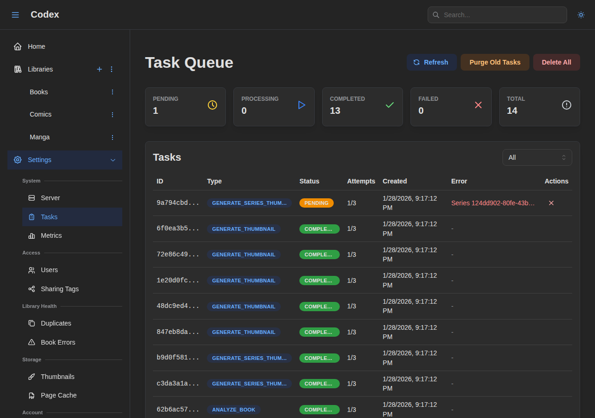
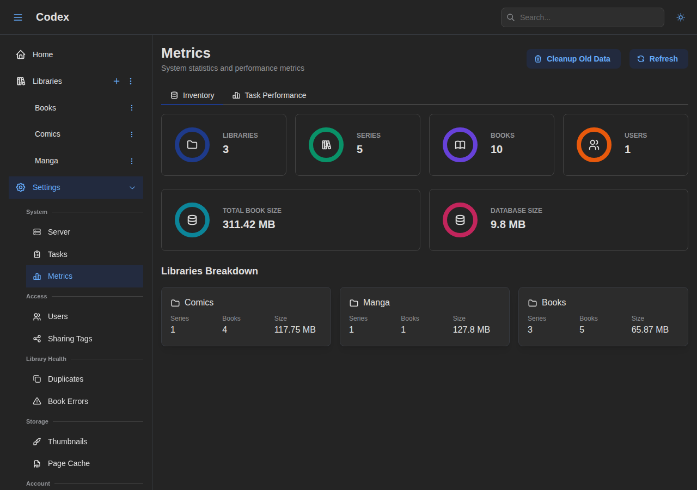
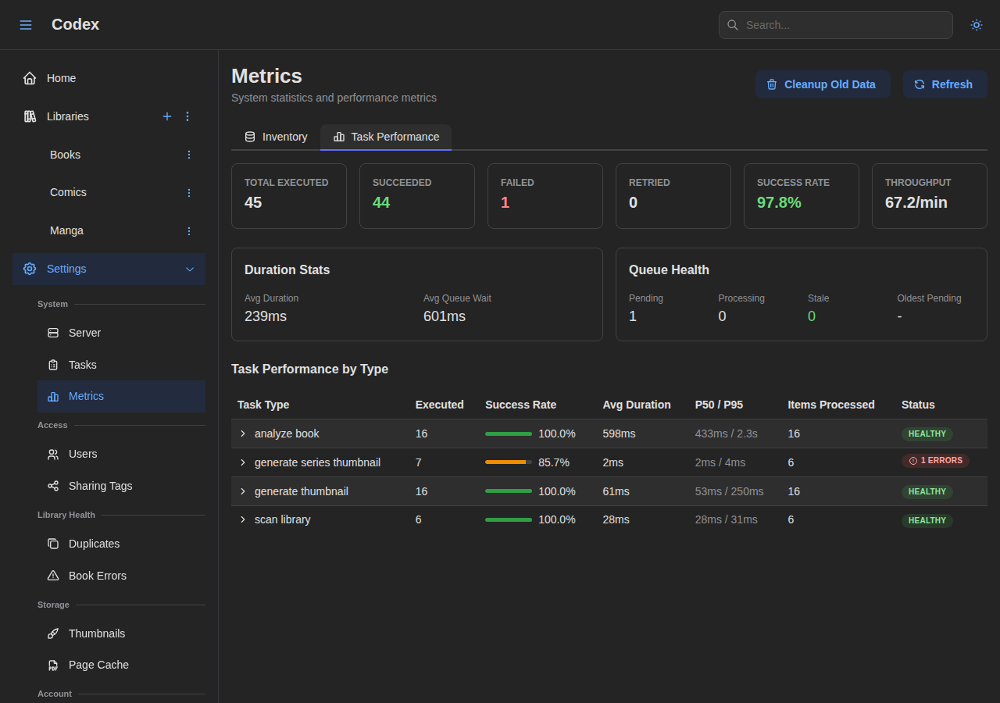

---
---

# Troubleshooting

This guide helps you diagnose and fix common issues with Codex.

## Quick Diagnostics

Before diving into specific issues, run these checks:

### Health Check

```bash
curl http://localhost:8080/health
```

Expected: `{"status":"ok"}`

### View Logs

```bash
# Docker
docker compose logs --tail=100 codex

# Systemd
journalctl -u codex --since "1 hour ago"

# Binary (if file logging enabled)
tail -f /var/log/codex/codex.log
```

### Check Configuration

```bash
# Docker
docker compose exec codex cat /app/config/config.docker.yaml

# Verify environment variables
docker compose exec codex env | grep CODEX
```

## Server Issues

### Server Won't Start

#### Symptoms

- Service fails to start
- Exit immediately after starting
- "Address already in use" error

#### Solutions

1. **Check port availability**:
   ```bash
   lsof -i :8080
   # Kill conflicting process or change port
   ```

2. **Verify configuration**:
   ```bash
   # Check for YAML syntax errors
   cat codex.yaml | python -c "import yaml,sys; yaml.safe_load(sys.stdin)"
   ```

3. **Check database path**:
   ```bash
   # For SQLite, ensure directory exists
   mkdir -p ./data
   ```

4. **Check permissions**:
   ```bash
   # Ensure user can write to data directory
   ls -la ./data
   ```

### Slow Performance

#### Symptoms

- Slow page loads
- API requests timeout
- High CPU/memory usage

#### Solutions

1. **Check resource usage**:
   ```bash
   docker stats codex
   # or
   htop
   ```

2. **Reduce concurrent scans**:
   ```yaml
   scanner:
     max_concurrent_scans: 1
   ```

3. **Check database performance**:
   ```bash
   # PostgreSQL
   docker compose exec postgres psql -U codex -c "SELECT count(*) FROM books;"
   ```

4. **Enable debug logging temporarily**:
   ```bash
   CODEX_LOGGING_LEVEL=debug docker compose up
   ```

### Server Hanging on Restart

#### Symptoms

- Container takes 10+ seconds to stop
- Frontend reloads slowly (30-60 seconds)
- Ctrl+C doesn't stop server immediately

#### Root Cause

This was fixed in recent versions. If you experience this:

1. **Update to latest version**:
   ```bash
   git pull
   docker compose build
   docker compose up -d
   ```

2. **Verify graceful shutdown**:
   ```bash
   docker compose logs | grep -i "shutdown"
   ```

   You should see:
   ```
   Received SIGTERM signal
   Starting graceful shutdown...
   Task worker shut down successfully
   Shutdown complete
   ```

## Database Issues

### Connection Failed

#### Symptoms

- "Connection refused" error
- "Database not found" error
- Timeout connecting to database

#### Solutions

**PostgreSQL**:

1. Check database is running:
   ```bash
   docker compose exec postgres pg_isready -U codex
   ```

2. Verify connection settings:
   ```yaml
   database:
     db_type: postgres
     postgres:
       host: postgres  # Docker service name
       port: 5432
       username: codex
       password: codex
       database_name: codex
   ```

3. Check network connectivity:
   ```bash
   docker compose exec codex ping postgres
   ```

**SQLite**:

1. Check file permissions:
   ```bash
   ls -la ./data/codex.db
   ```

2. Check directory is writable:
   ```bash
   touch ./data/test && rm ./data/test
   ```

### Database Locked (SQLite)

#### Symptoms

- "database is locked" errors
- Operations fail intermittently
- Scan hangs

#### Solutions

1. **Don't run separate workers with SQLite**:
   SQLite cannot handle concurrent writes from multiple processes.

2. **Use WAL mode** (recommended):
   ```yaml
   database:
     sqlite:
       pragmas:
         journal_mode: WAL
   ```

3. **Reduce concurrent operations**:
   ```yaml
   scanner:
     max_concurrent_scans: 1
   task:
     worker_count: 2
   ```

4. **Consider PostgreSQL** for multi-user environments.

### Migration Errors

#### Symptoms

- "Migration failed" on startup
- Database schema errors
- Missing columns/tables

#### Solutions

1. **Check migration status**:
   ```bash
   docker compose exec codex codex migrate --config /app/config/config.docker.yaml
   ```

2. **Backup and reset** (development only):
   ```bash
   # Backup
   pg_dump -U codex codex > backup.sql

   # Reset
   docker compose down -v
   docker compose up -d
   ```

## Library & Scanning Issues

### Library Not Found

#### Symptoms

- "Path does not exist" error
- Library shows 0 books
- Scan fails immediately

#### Solutions

1. **Check path exists** (Docker):
   ```bash
   docker compose exec codex ls -la /library
   ```

2. **Verify volume mount**:
   ```yaml
   volumes:
     - /your/actual/path:/library:ro
   ```

3. **Check permissions**:
   ```bash
   # The codex user needs read access
   ls -la /your/actual/path
   ```

### Scan Not Finding Files

#### Symptoms

- Scan completes with 0 books
- Files exist but aren't detected
- Some formats not recognized

#### Solutions

1. **Check file extensions**:
   Supported: `.cbz`, `.cbr`, `.epub`, `.pdf`

2. **Verify files aren't corrupted**:
   ```bash
   file /library/somebook.cbz
   unzip -t /library/somebook.cbz
   ```

3. **Check scan logs**:
   ```bash
   docker compose logs codex | grep -i "scan\|error"
   ```

4. **Try deep scan**:
   ```bash
   curl -X POST "http://localhost:8080/api/v1/libraries/{id}/scan?mode=deep" \
     -H "Authorization: Bearer $TOKEN"
   ```

### Scan Taking Too Long

#### Symptoms

- Scan running for hours
- Progress stuck at certain percentage
- High disk I/O

#### Solutions

1. **Check library size**:
   Large libraries (10,000+ books) take time on first scan.

2. **Monitor the Task Queue**:
   Go to **Settings** > **Tasks** to view active and pending tasks.

   

3. **Use normal scan** for updates:
   Deep scans re-process everything.

4. **Check disk I/O**:
   ```bash
   iostat -x 1
   ```

5. **Reduce concurrent scans**:
   ```yaml
   scanner:
     max_concurrent_scans: 1
   ```

### Metadata Not Extracted

#### Symptoms

- Books show with wrong titles
- Series not detected
- Missing author/publisher info

#### Solutions

1. **Add ComicInfo.xml** to comics:
   ```xml
   <?xml version="1.0"?>
   <ComicInfo>
     <Title>Issue Title</Title>
     <Series>Series Name</Series>
     <Number>1</Number>
   </ComicInfo>
   ```

2. **Run deep scan** to re-extract:
   ```bash
   curl -X POST "http://localhost:8080/api/v1/libraries/{id}/scan?mode=deep" \
     -H "Authorization: Bearer $TOKEN"
   ```

3. **Check filename format**:
   `Series Name 001.cbz` is better than `random_name.cbz`

## Authentication Issues

### Login Failed

#### Symptoms

- "Invalid credentials" error
- Can't log in after setup
- Token expired errors

#### Solutions

1. **Verify credentials** (case-sensitive):
   ```bash
   curl -X POST http://localhost:8080/api/v1/auth/login \
     -H "Content-Type: application/json" \
     -d '{"username":"admin","password":"yourpassword"}'
   ```

2. **Reset password** (via admin):
   ```bash
   curl -X PUT http://localhost:8080/api/v1/users/{id} \
     -H "Authorization: Bearer $ADMIN_TOKEN" \
     -d '{"password":"newpassword"}'
   ```

3. **Check JWT secret is set**:
   ```yaml
   auth:
     jwt_secret: "your-secret-here"  # Must be set!
   ```

### API Key Not Working

#### Symptoms

- "Unauthorized" with valid key
- Key works in curl but not in app
- Permissions denied

#### Solutions

1. **Check key format**:
   ```bash
   # As header
   curl -H "Authorization: Bearer codex_abc123..."

   # As X-API-Key
   curl -H "X-API-Key: codex_abc123..."
   ```

2. **Verify key permissions**:
   Keys can only have permissions the creator has.

3. **Check key isn't revoked**:
   ```bash
   curl http://localhost:8080/api/v1/api-keys \
     -H "Authorization: Bearer $TOKEN"
   ```

## SSE (Real-Time Updates) Issues

### Events Not Received

#### Symptoms

- Progress not updating in real-time
- Scan status shows "unknown"
- No notifications for new books

#### Solutions

1. **Check SSE connection** (browser DevTools):
   - Network tab > filter "stream"
   - Status should be 200 (pending)

2. **Verify authentication**:
   SSE streams require valid auth token.

3. **Check reverse proxy config**:
   ```nginx
   # Nginx - disable buffering for SSE
   proxy_buffering off;
   proxy_cache off;
   ```

### SSE Disconnecting Frequently

#### Symptoms

- Connection drops every 30 seconds
- "Reconnecting..." messages
- Inconsistent updates

#### Solutions

1. **Extend timeout** in reverse proxy:
   ```nginx
   proxy_read_timeout 86400s;
   proxy_send_timeout 86400s;
   ```

2. **Check keep-alive settings**:
   Codex sends keep-alive every 15 seconds.

3. **Update to latest version**:
   Recent fixes improved SSE reliability.

## Docker Issues

### Container Won't Start

#### Symptoms

- Container restarts repeatedly
- "Exited with code 1"
- Health check failing

#### Solutions

1. **Check logs**:
   ```bash
   docker compose logs codex
   ```

2. **Verify dependencies**:
   ```bash
   docker compose ps
   # postgres should be healthy before codex starts
   ```

3. **Check resources**:
   ```bash
   docker system df
   # Ensure disk space available
   ```

### Port Conflicts

#### Symptoms

- "Port already in use"
- Can't access Codex

#### Solutions

1. **Find conflicting process**:
   ```bash
   lsof -i :8080
   lsof -i :5432
   ```

2. **Change ports** in docker-compose:
   ```yaml
   ports:
     - "8081:8080"  # Map to different host port
   ```

### Volume Permission Issues

#### Symptoms

- "Permission denied" errors
- Can't write to data directory
- Scan can't read files

#### Solutions

1. **Check host permissions**:
   ```bash
   ls -la /path/to/library
   ```

2. **Run as correct user** (Linux):
   ```yaml
   services:
     codex:
       user: "1000:1000"  # Match host user
   ```

## Frontend Issues

### Page Not Loading

#### Symptoms

- Blank page
- JavaScript errors
- API calls failing

#### Solutions

1. **Check API is responding**:
   ```bash
   curl http://localhost:8080/api/v1/auth/me \
     -H "Authorization: Bearer $TOKEN"
   ```

2. **Clear browser cache**:
   Hard refresh: Ctrl+Shift+R

3. **Check browser console** for errors.

### Images Not Loading

#### Symptoms

- Covers show placeholder
- Pages don't display
- 404 errors for images

#### Solutions

1. **Check thumbnail directory**:
   ```bash
   ls -la ./data/thumbnails/
   ```

2. **Verify file permissions**:
   Codex needs write access to thumbnail cache.

3. **Regenerate thumbnails**:
   Run a scan to regenerate missing thumbnails.

## Getting Help

If you're still experiencing issues:

### Check Server Metrics

Go to **Settings** > **Metrics** to view server statistics including inventory counts and task history.





### Gather Information

1. **Codex version**:
   ```bash
   codex --version
   ```

2. **Full logs**:
   ```bash
   docker compose logs > codex-logs.txt
   ```

3. **Configuration** (redact secrets):
   ```bash
   cat codex.yaml
   ```

4. **System info**:
   ```bash
   docker version
   uname -a
   ```

### Report Issues

- [GitHub Issues](https://github.com/AshDevFr/codex/issues)
- Include:
  - Steps to reproduce
  - Expected vs actual behavior
  - Logs and configuration
  - System information
