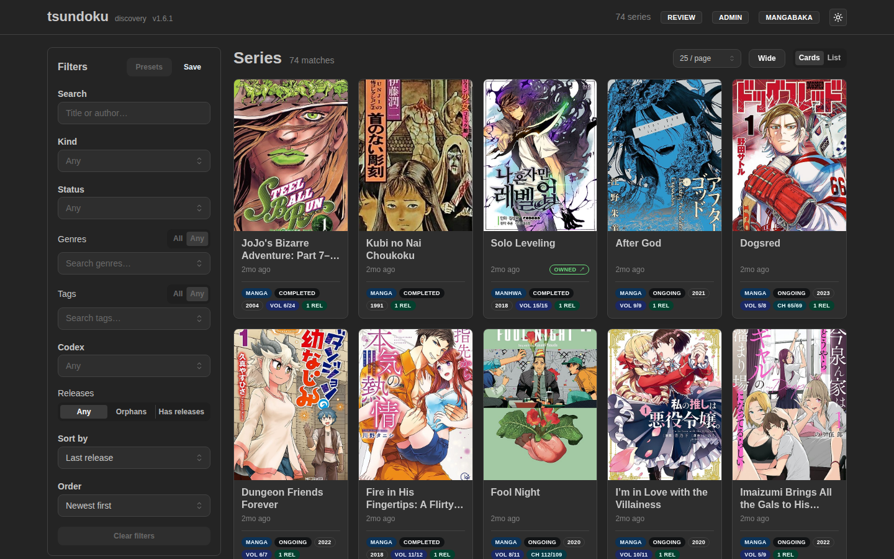

---
---

# Tsundoku

[Tsundoku](https://tsundoku.4sh.dev) is a standalone companion service to Codex that helps you **discover manga series you don't own yet**. Where Codex's [Release Tracking](./release-tracking.md) watches series already in your library and tells you when a new chapter or volume drops, Tsundoku does the opposite: it polls discovery sources, resolves each release to a known series, and maintains a browsable catalog of titles that are *not* yet in your Codex library.

The two are complementary halves of the same workflow:

- **Codex Release Tracking** answers: "A series I already own has a new release, where is it?"
- **Tsundoku** answers: "What series are out there that I haven't started collecting?"

:::info Separate project
Tsundoku is its own service with its own repository, docs, and release cycle. It is **not** bundled with Codex, and Codex works fully without it. This page exists so Codex users know it's available and understand how the two fit together.

- **Docs:** [tsundoku.4sh.dev](https://tsundoku.4sh.dev)
- **Source:** [github.com/AshDevFr/tsundoku](https://github.com/AshDevFr/tsundoku)
:::

## How it fits with Codex

Tsundoku polls discovery sources (Nyaa.si in v1), matches each discovered release against a metadata provider (MangaBaka in v1), and builds a local catalog of series with an operator review queue. It deliberately **does not** track releases for series you already own, download or post-process torrents, or write to Codex's database. Like Codex's release tracking, it is notify-and-browse only.

To know which catalog entries you already have, Tsundoku reads from Codex **over Codex's HTTP API, one direction only**:

- It probes `GET /api/v1/info` to check reachability.
- It pages through `GET /api/v1/series/external-index` (with an API key) to learn which series Codex knows about and their external IDs and owned volume/chapter highs.

It uses that to overlay an "owned" badge onto its own catalog so you can focus on series you *don't* have. Codex is never modified by Tsundoku; the integration is read-only from Tsundoku's side.

## Connecting Tsundoku to Codex

The connection is configured **in Tsundoku**, not in Codex. On the Codex side you only need to provide an API key with read access to series:

1. In Codex, create an [API key](./users/api-keys.md) for Tsundoku to use.
2. In Tsundoku's config, enable the Codex integration and set the Codex base URL and that API key.

See the [Tsundoku documentation](https://tsundoku.4sh.dev) for the exact configuration keys and deployment guidance (it ships as a single Rust binary / container, in the same spirit as Codex).

## When you'll want it

Reach for Tsundoku if you actively grow your manga collection and want a curated "to-read / to-acquire" pile (its name is the Japanese term for letting unread books pile up) that already knows what you own. If you only want notifications for series already in your library, Codex's built-in [Release Tracking](./release-tracking.md) with the [Nyaa](./plugins/release-nyaa.md) and [MangaUpdates](./plugins/release-mangaupdates.md) plugins is all you need.
